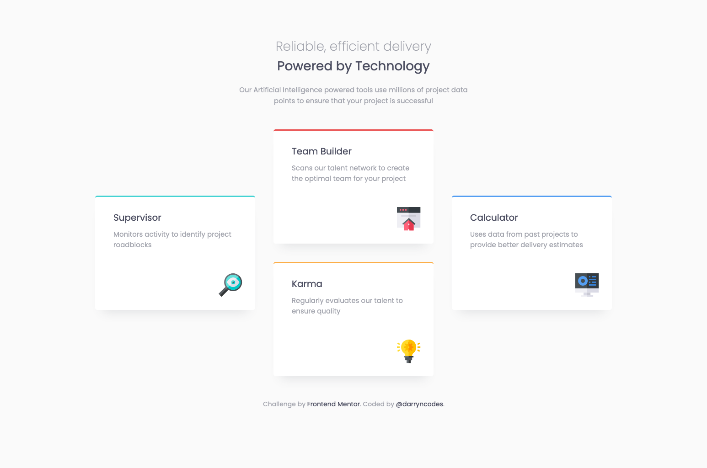
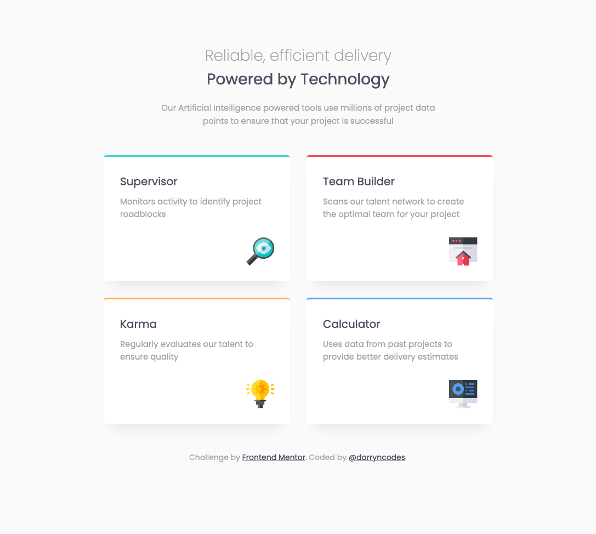
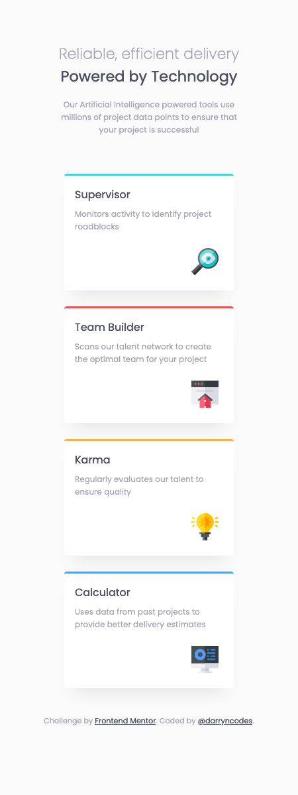

# Frontend Mentor - Four card feature section solution

This is a solution to the [Four card feature section challenge on Frontend Mentor](https://www.frontendmentor.io/challenges/four-card-feature-section-weK1eFYK). Frontend Mentor challenges help you improve your coding skills by building realistic projects.

## Table of contents

-   [Overview](#overview)
    -   [The challenge](#the-challenge)
    -   [Screenshot](#screenshot)
    -   [Links](#links)
-   [My process](#my-process)
    -   [Built with](#built-with)
    -   [What I learned](#what-i-learned)
    -   [Useful resources](#useful-resources)
-   [Author](#author)

## Overview

### The challenge

Users should be able to:

-   View the optimal layout for the site depending on their device's screen size

### Screenshot

### Links

-   [GitHub repo](https://github.com/darryncodes/four-card-feature-section)
-   [Solution URL](https://darryncodes.github.io/four-card-feature-section/)

## My process

### Built with

-   Semantic HTML5 markup
-   SASS
-   Flexbox
-   CSS Grid
-   Mobile-first workflow
-   BEM methodology

### What I learned

-   Mobile-first workflow

### Useful resources

-   [A Complete Guide to Grid](https://css-tricks.com/snippets/css/complete-guide-grid/)
-   [Box Shadow CSS Generator](https://cssgenerator.org/box-shadow-css-generator.html)
-   [The State Of Mobile First and Desktop First](https://ishadeed.com/article/the-state-of-mobile-first-and-desktop-first/)

## Author

-   Work in progress portfolio site - [@darryncodes](https://www.darryncodes.co.uk/)
-   Frontend Mentor - [@darryncodes](https://www.frontendmentor.io/profile/darryncodes)
